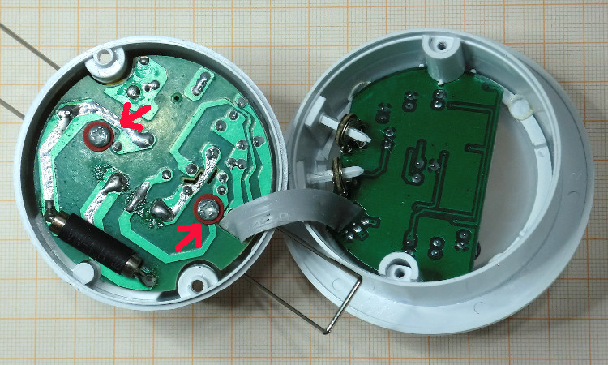
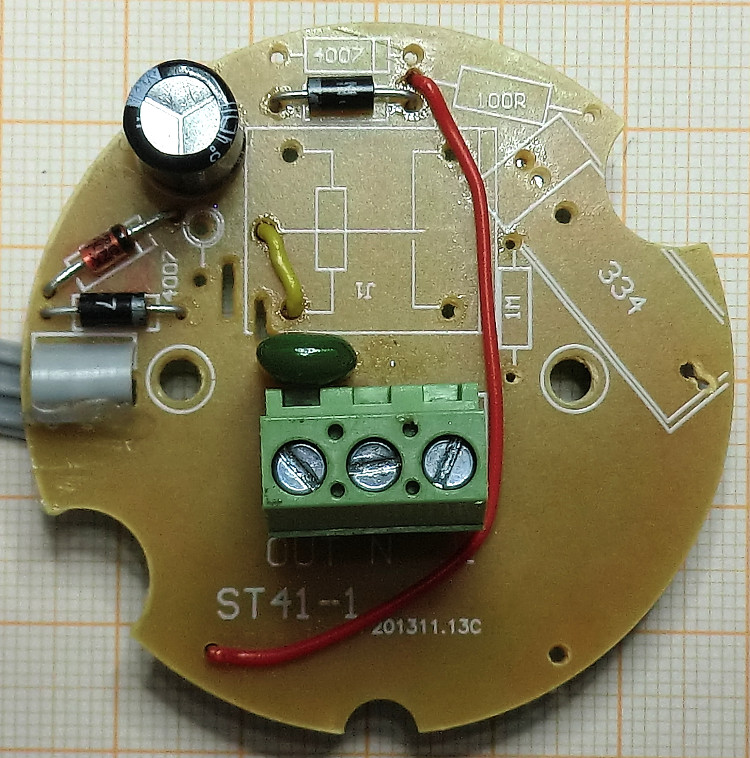

# Umbau eines Decken-Einbau-Bewegungsmelders auf 24V (Alte Version ST41-1)
> ** Inzwischen gibt es eine neuere Version des Bewegungsmelders. Bei dieser werden die 50Hz Wechselspannung zum Triggern benötigt, um ein Schalten des Relais beim Nulldurchgang der Wechselspannung zu bewirken (Vermeidung hoher Einschaltströme). Der hier beschriebene Umbau funktioniert damit mit der neuen Version nicht. **

> ** Die neue Version ist leider nicht äusserlich (Gehäuse, Beschriftung, EAN Nummer, Karton etc.) zu erkennen. Die beiden Leiterplatten haben jedoch ein anderes Layout (Bspw. andere Anordnung der Bauelemente, zusätzliche SMD Widerstände auf der Netzteil/Relais-Platine bei der neuen Version). Auf der Leiterplatte ist die alte Version mit ST41-1, die neue Version mit ST41-G2 bezeichnet. **

> ** [Zur Anleitung für die neue Version](../PIR2mod/README.md) **

> ** Den Umbau nach unterer Anleitung bitte nur vornehmen, wenn die Leiterplatten so aussehen, wie in den unteren Bildern dargestellt. **
</WRAP>

## Ziel

Beschreiben wird der Umbau eines 230 V Bewegungsmelders auf 24 Volt Btetriebsspannung, so dass dieser direkt im Homatic-System an einen Schalteingang des HomeMatic Wired RS485 Schließerkontakt Sensors (HMW-Sen-SC-12-DR) angeschlossen werden kann.

Bei dem hier verwendeten Bewegungsmelder handelt sich es um den nebenstehend abgebildeten Melder. Dieser wird in identischer Hardware von mehreren Anbietern angeboten. Im Abschnitt "Links" sind entsprechende Amazon-Artikel aufgelistet.

Der umgebaute Bewegungsmelder hat folgende Eigenschaften:
  * Betriebsspannung 24V
  * Verpolungs- und Überspannungsschutz
  * Schaltausgang wird bei Bewegungserkennung gegen Masse geschaltet, daher direkter Betrieb am Eingang des Schließerkontakt Sensors (HMW-Sen-SC-12-DR) möglich
  * Lautlos durch Entfernung des Relais

## Umbau
### Öffnen des Bewegungsmelders

Das Öffnen des Gehäuses erfolgt durch Lösen von zwei Schrauben, jeweils neben den Haltefedern. Anschließend wird die Leistungsplatine ebenfalls durch Lösen von zwei Schrauben aus dem Gehäuse genommen.

### Entfernung von Bauelementen
Im ersten Schritt werden nicht benötigte Bauteile entfernt:
  * Sicherung auf der Leiterseite
  * Kondensator, Reihen- sowie Parallelwiderstand des Kondensatornetzteiles.
  * 2 Dioden des Brückengleichrichters (2 Dioden bleiben zwecks Verpolungsschutz in der Schaltung)
  * Zener-Diode (wird ersetzt durch eine 24V Zener-Diode)

Die entsprechenden Bauteile sind in den folgenden Bildern rot umrandet.

Auf den nächsten zwei Bildern sind die entfernen Bauelemente sowie die Leiterplatte nach dem Entfernen abgebildet.

### Einlöten von Drahtbrücken und neuer Zener-Diode

Es werden zwei Drahtbrücken eingelötet, jeweils zwischen den gleichfarbigen Punkten:

  * rot: Betriebsspannung 24V
  * gelb: Schaltausgang

Die zuvor entfernte Zener-Diode wird durch eine neue 24V Zener-Diode ersetzt. Dabei ist unbedingt auf die Polung zu achten. Die Katode, gekennzeichnet durch eine farblichen Ring, liegt auf der Leiterplatte rechts, neben dem großen Elekrolytkondensator.

### Zusammenbau und Anschlussbelegung
Der Zusammenbau solle keine große Hürde darstellen. Die Anschlüsse sind entsprechend zu kennzeichnen:
  * L -> +24V (+)
  * N -> Masse (-)
  * A -> Schaltausgang

Eine Nutzung am Schließerkontakt Sensors (HMW-Sen-SC-12-DR) ist oben dargestellt.

## Sonstiges
### Stromaufnahme
Der Bewegungsmelder hat bei einer Betriebsspannung von 24 V eine Stromaufnahme von ca. 7mA.
