# Umbau eines Decken-Einbau-Bewegungsmelders auf 24V
## Ziel
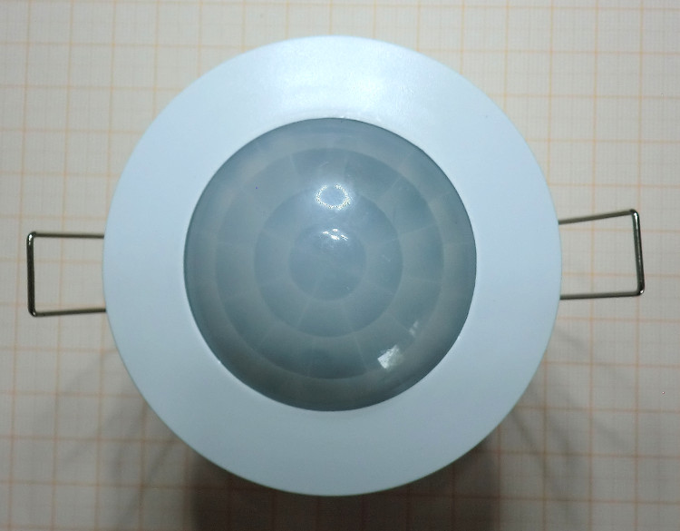
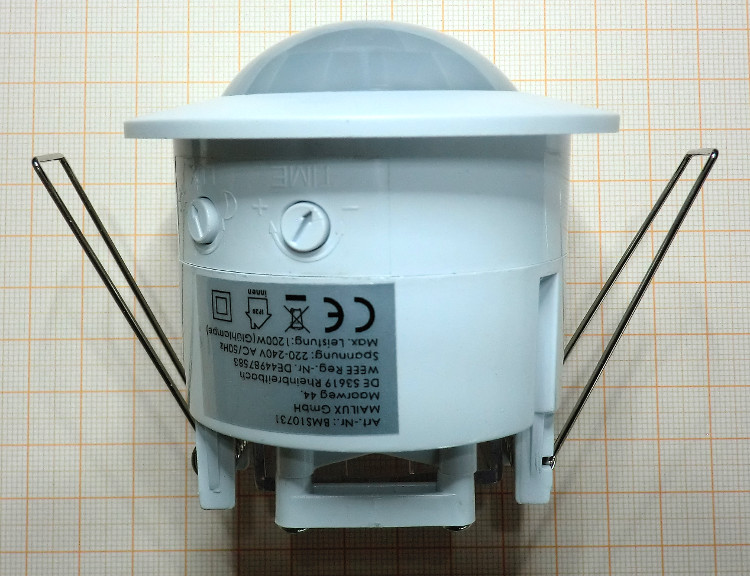
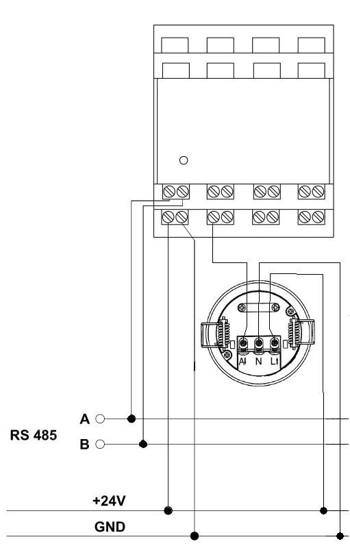

Beschreiben wird der Umbau eines 230 V Bewegungsmelders auf 24 Volt Btetriebsspannung, so dass dieser direkt im Homatic-System an einen Schalteingang des HomeMatic Wired RS485 Schließerkontakt Sensors (HMW-Sen-SC-12-DR) angeschlossen werden kann.

Bei dem hier verwendeten Bewegungsmelder handelt sich es um den oben abgebildeten Melder. Dieser wird in identischer Hardware von mehreren Anbietern angeboten. Im Abschnitt "Links" sind entsprechende Artikel aufgelistet.

Der umgebaute Bewegungsmelder hat folgende Eigenschaften:
  * Betriebsspannung 24V
  * Verpolungs- und Überspannungsschutz
  * Schaltausgang wird bei Bewegungserkennung gegen Masse geschaltet, daher direkter Betrieb am Eingang des Schließerkontakt Sensors (HMW-Sen-SC-12-DR) möglich
  * Lautlos durch Entfernung des Relais

## Umbau
### Taktgeber
Der Bewegungsmelder verwendet die 50Hz Wechselspannung zum Triggern, um ein Schalten des Relais im Nulldurchgang zu bewirken. Dies dient vor allem zur Vermeidung von hohen Einschaltströmen, die durch Lichtbogenbildung zum "Verkleben" der Relaiskontakte führen können.

Da nach dem Umbau die Wechselspannung nicht mehr zur Verfügung steht, wird der Takt zum Triggern durch eine kleine Zusatzschaltung bereitgestellt.

[Taktgeber PIRMOD V1](taktgeber_pirmod_v1.md)

Dieser Taktgeber ist Voraussetzung für die Funktion des Bewegungsmelders mit 24V Gleichspannung.

### Öffnen des Bewegungsmelders
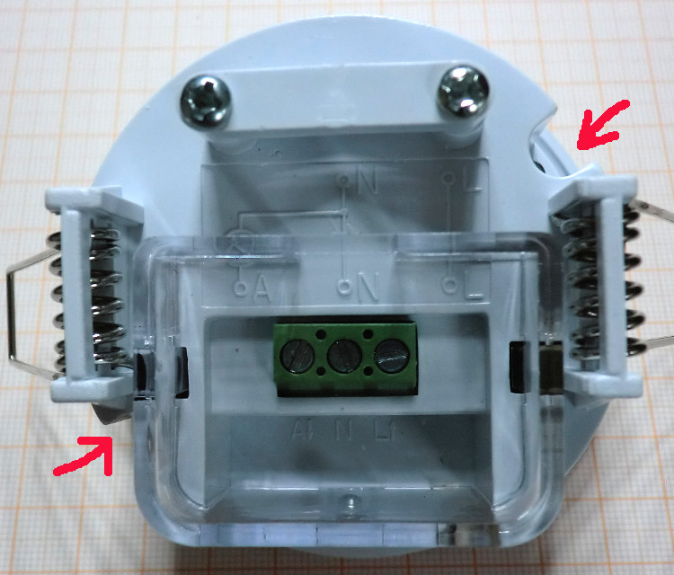

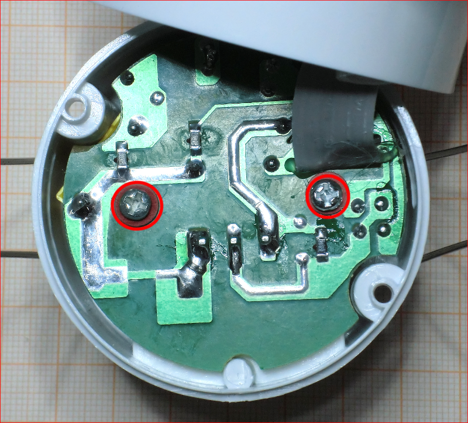

Das Öffnen des Gehäuses erfolgt durch Lösen von zwei Schrauben, jeweils neben den Haltefedern. Anschliessend wird die Leistungsplatine ebenfalls durch Lösen von zwei Schrauben aus dem Gehäuse genommen.

### Entfernung von Bauelementen
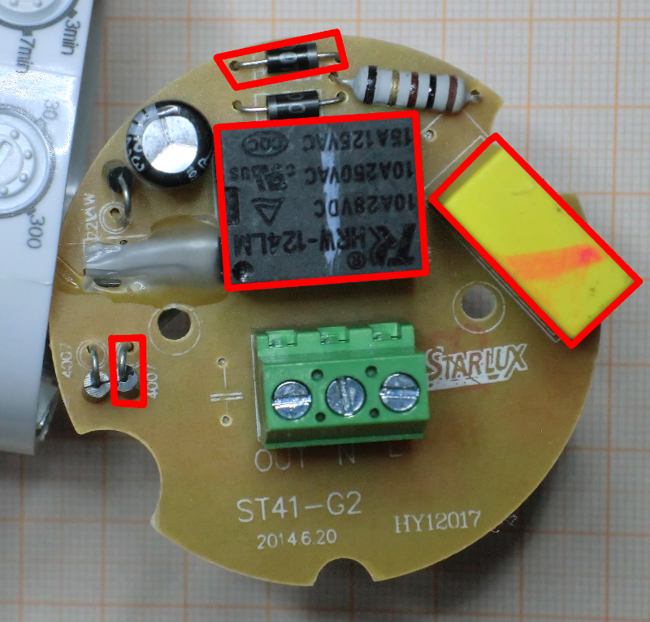

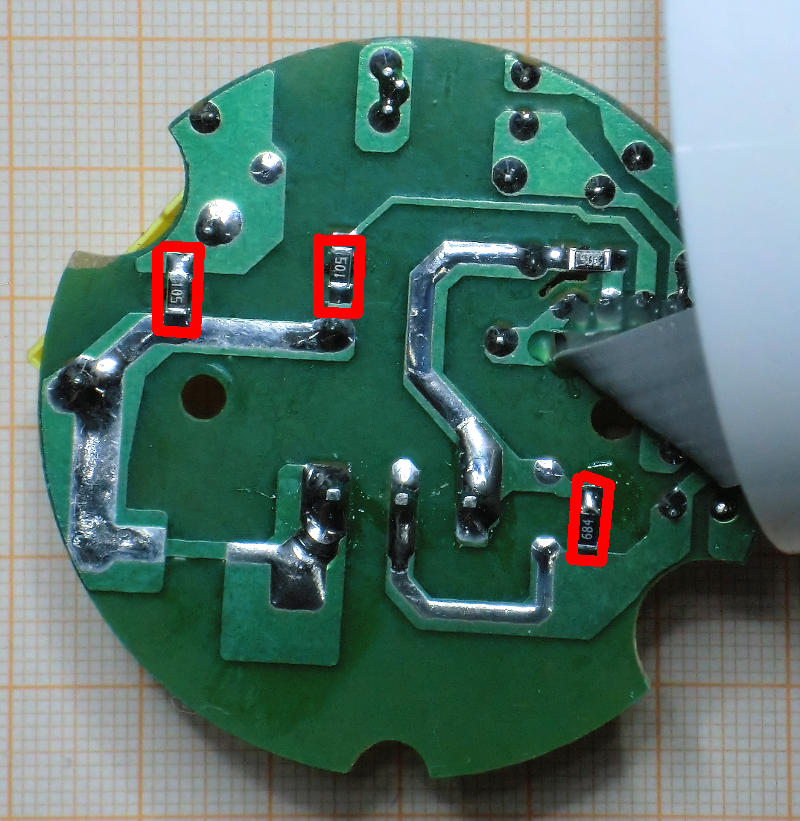

Im ersten Schritt werden nicht benötigte Bauteile entfernt:
  * Bestückungsseite  
    * Relais
    * Kondensator des Kondensator-Netzteiles
    * 2 Dioden des Brückengleichrichters (2 Dioden bleiben zwecks Verpolungsschutz in der Schaltung))
  * Leiterseite
    * 3 SMD-Widerstände

Die entsprechenden Bauteile sind in den obigen Bildern rot umrandet. Auf den nächsten Bildern sind die entfernen Bauelemente sowie die Leiterplatte nach dem Entfernen abgebildet.

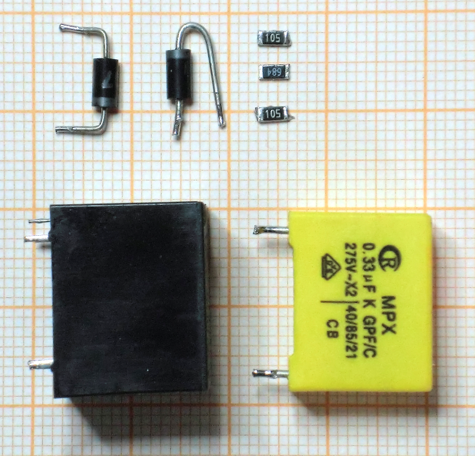

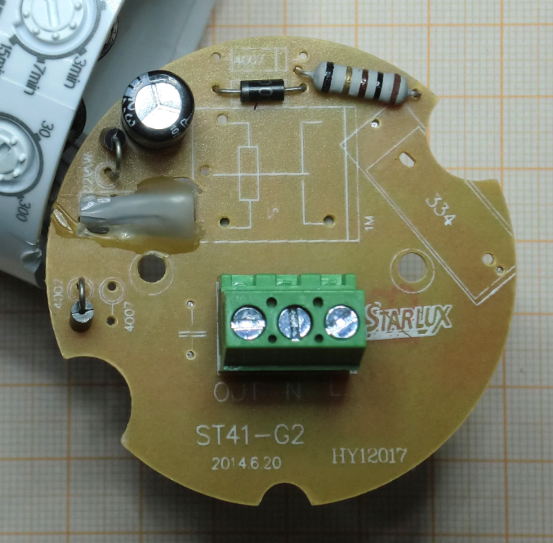

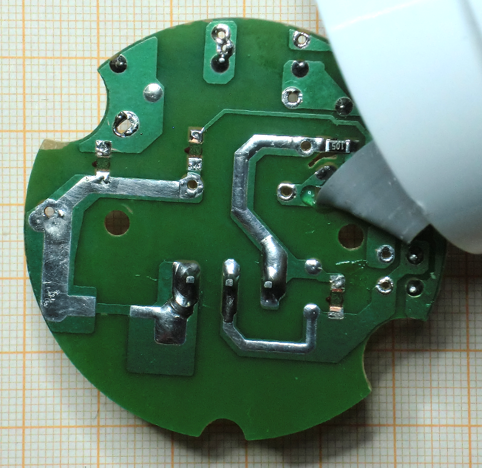

### Einlöten einer Drahtbrücke sowie Leitungsdurchtrennung
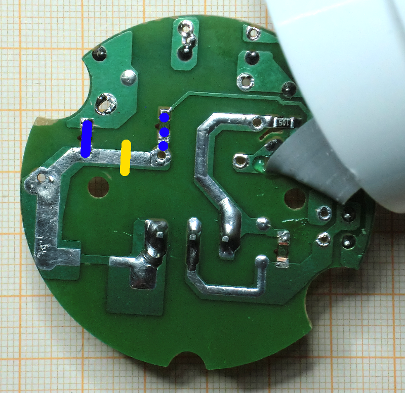

Auf der Leiterseite wird anstelle eines ausgelöteten Widerstandes eine Drahtbrücke eingelötet. Diese ist in der Abbildung links als durchgehender blauer Strich dargestellt.

Des Weiteren wird die Leiterbahn an der mit dem gelben Strich gekennzeichneten Stelle durchtrennt.

An der gepunkteten blauen Linie wird die Drahtbrücke im Zuge des folgenden Einbaus des Katgebers realisiert.
### Einsetzen des Taktgebers
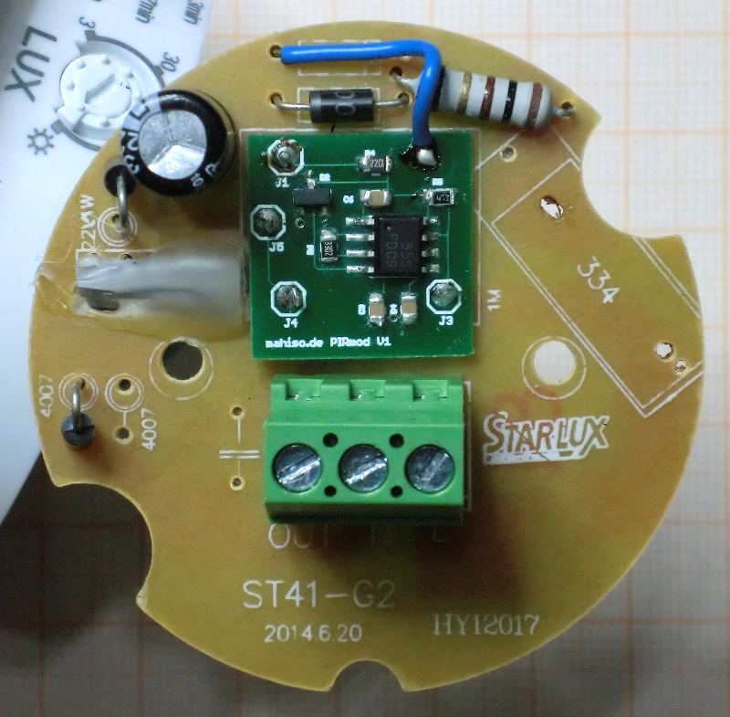

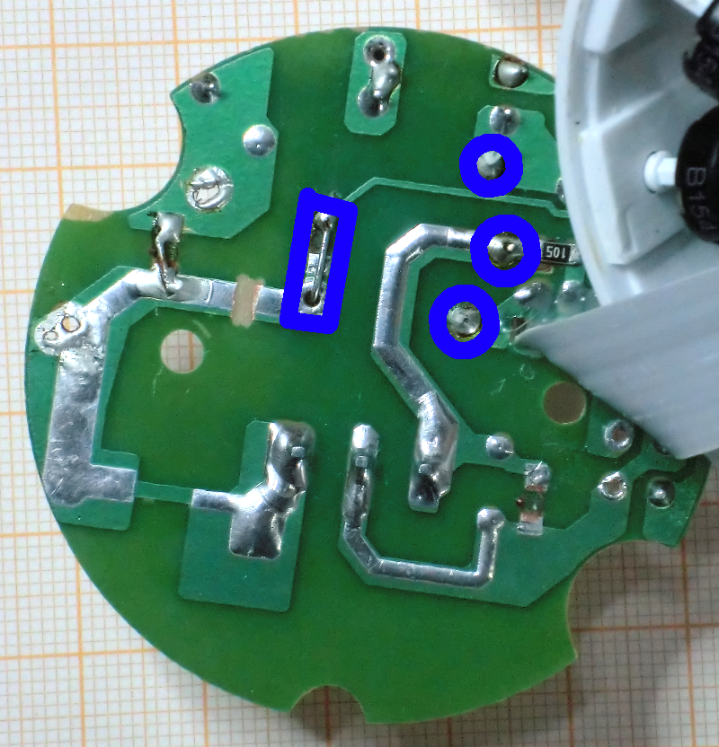

Nun wird der Takgeber eingesetzt.

Auf der Leiterseite erfolgt die Verlötung der bereits vorhandenen Anschlussdrähte. Dabei ist beim linken Kontakt, anstelle des ausgelöteten Widerstandes, eine Drahtbrücke zu bilden.

Auf der Bestückungsseite wird mit zusätzlich Taktgeber mit einem Stück isolierter Litze kontaktiert, in der Abbildung blau. (Lötpad oben rechts auf dem Taktgeber zum linken Anschluss der vormals vorhandenen Diode).   

### Zusammenbau und Anschlussbelegung
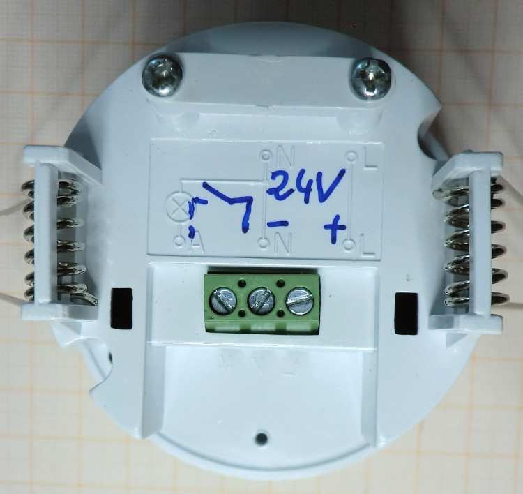

Der Zusammenbau solle keine große Hürde darstellen. Die Anschlüsse sind entsprechend zu kennzeichnen:
  * L -> +24V (+)
  * N -> Masse (-)
  * A -> Schaltausgang

Eine Nutzung am Schließerkontakt Sensors (HMW-Sen-SC-12-DR) ist oben dargestellt.

## Sonstiges
### Stromaufnahme
Der Bewegungsmelder hat bei einer Betriebsspannung von 24 V eine Stromaufnahme von ca. 7mA.

### Links
  * Amazon: [Homematik 12-fach Kontaktsensor](https://www.amazon.de/s/ref=as_li_ss_tl?_encoding=UTF8&camp=1638&creative=19454&field-keywords=HMW-Sen-SC-12-DR&linkCode=ur2&site-redirect=de&tag=mahisode-21&url=search-alias%3Daps)

Folgende Bewegungsmelder sind technisch identisch und lassen sich mit dieser Anleitung umbauen:
  * Amazon: [Infrarot Bewegungsmelder Unterputz Indoor](https://www.amazon.de/gp/product/B007RRTBUY/ref=as_li_ss_tl?ie=UTF8&tag=mahisode-21&camp=1638&creative=19454&creativeASIN=B007RRTBUY&linkCode=as2)  
  * Amazon: [MAILUX Decken-Einbau-Bewegungsmelder](https://www.amazon.de/gp/product/B00B4WQ5Z2/ref=as_li_ss_tl?ie=UTF8&tag=mahisode-21&camp=1638&creative=19454&creativeASIN=B00B4WQ5Z2&linkCode=as2)
