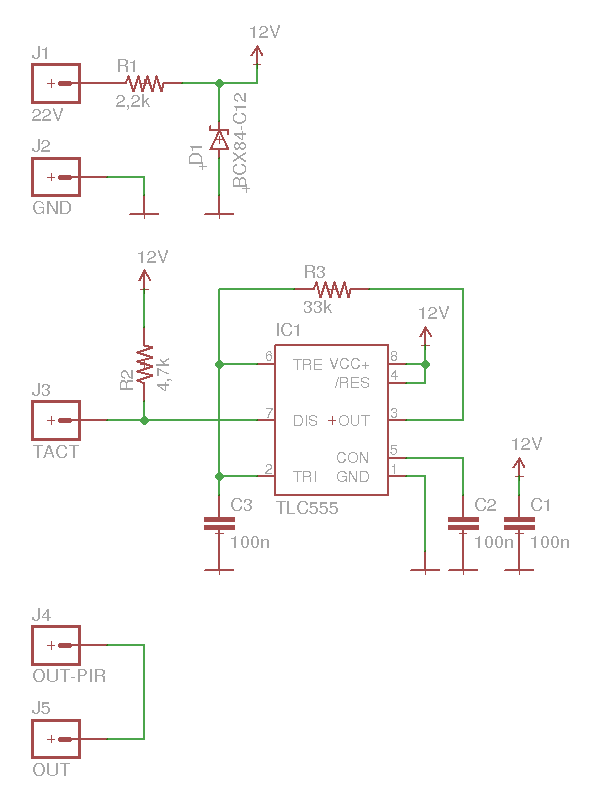
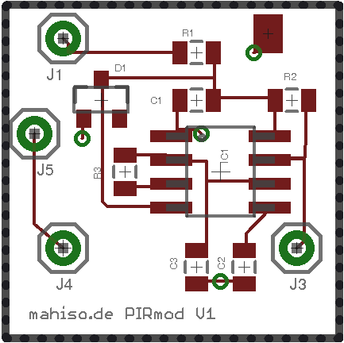
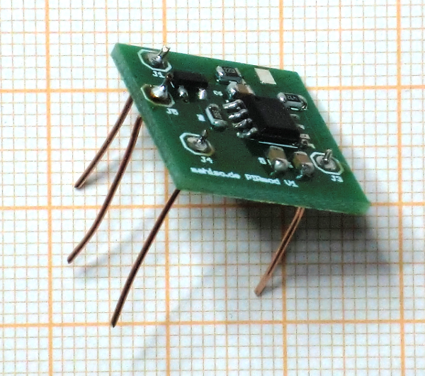

# Taktgeber PIRMOD V1
## Ziel
Die Schaltung erzeugt einen Takt, der zum Triggern des Schaltvorganges von Bewegungsmeldern genutzt wird. Dieser Takt ist notwendig nach Umbau von 230V Bewegungsmeldern auf 24V Gleichspannung Betriebsspannung, da die ursprünglich verwendete 230V Wechselspannung nicht mehr zur Verfügung steht.
## Schaltung

Zentraler Teil der Schaltung ist der Timer-Schaltkreis 555. Dieser erzeugt, geregelt durch die R/C-Kombination R3/C3 einen rechteckigen Takt, der über J3 dem Bewegungsmelder am Triggereingang zur Verfügung gestellt wird.

Der Timer wird mit einer Betriebspannung von 12V betrieben, die über R1/D1 aus der vom Bewegungsmelder stammenden Spannung von 22V (J1) erzeugt wird.

## Leiterplatte

Die Schaltung wird auf einer doppelseitigen Leiterplatte von 18x18mm² Größe aufgebaut. Die nebenstehende Abbildung zeigt die Bestückungsseite.

Die Anschlüsse J1, J3 bis J5 werden mit kurzen, unisolierten Drähten versehen. J2 (GND) wird später mit einer kurzen isolierten Litze bestückt.

## Stückliste
| Bauteil | Wert / Bauform | Einzelpreis |
|---------|----------------|-------------|
|IC1|TLC555 / SO-08|  0,60 ∈  |
|D1|BCX84-C12 / SOT-23-3 |  0,23 ∈  |
|R1| 2,2 kΩ / 0805 |  0,02 ∈  |
|R2| 4,7 kΩ / 0805 |  0,02 ∈  |
|R3| 33 kΩ / 0805 |  0,02 ∈  |
|C1, C2, C3| 100 nF / 0805 |  0,04 ∈  |
| | Leiterplatte |  2,50 €  |
