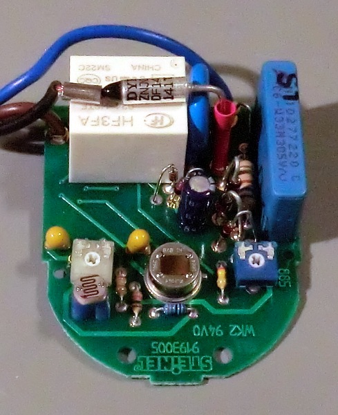

# Umbau eines Steinel Bewegungsmelders IS1 auf 24 Volt
## Ziel
Im Homematic-System sind ausschließlich Bewegungsmelder mit Batterie- und Funkbetrieb im Angebot. Auf dem Markt sind angebotene Bewegungsmeldermit einer Betriebsspannung von 24 Volt, welche für alle Wired-Komponenten verwendet wird, sehr rar verfügbar und teuer.
Ziel ist, einen preislich günstigen Bewegungsmelder für 230V Netzspannung auf 24 Volt umzubauen. Der umgebaute Bewegungsmelder hat folgende Eigenschaften:
  * Betriebsspannung 24 Volt.
  * Verpolungsschutz für die Betriebsspannung.
  * Einfache Anbindung als Schalter an den HomeMatic Wired RS485 Schließerkontakt Sensor (HMW-Sen-SC-12-DR) durch Schaltung des Relaykontaktes gegen Masse.

Für den hier beschriebenen Umbau wird ein Steinel IS1 verwendet.

> **Inzwischen hat Steinel das Layout der Schaltung verändert. Die 50Hz Wechselspannung werden zum Triggern verwendet.
Damit ist der Umbau, wie hier beschrieben, nicht mehr so ohne weiteres möglich. Informationen dazu im
[HomeMatic Forum](http://homematic-forum.de/forum/viewtopic.php?f=31&t=11754&start=20).**

## Umbau
### Zerlegen des Bewegungsmelders

Zum Zerlegen des Bewegungsmelders ist ein kleiner Schraubendreher sowie ein Kreuzschraubendreher notwendig.
  - Abnahme der rückseitigen Montageplatte.
  - Entfernen der Klemmleiste von den Anschlusskabeln.
  - Metallhalteklammer, die die seitliche Drehung des Sensors ermöglicht, mit einem kleinen Schraubendreher entfernen
  - Halterung der Sensorkasel durch Lösen der Kreuzschraube auf der Unterseite öffnen und beide Halbschalen entfernen.
  - Die Sensorkapsel wird seitlich mit zwei schwarzen Ringen zusammengehalten. Diese Ringe und ein auf einer Seite
  enthaltener Gummiring entfernen.
  - Die schwarze und die weiße Kappen auseinanderziehen.
  - Die Platine kann entnommen werden.

### Anpassen der Schaltung
Der Sensorschaltung des Bewegungsmelders wird bereits mit 24V betrieben, welche über ein Kondensatornetzteil erzeugt
wird. Bei Erkennung einer Bewegung wird das Relais geschaltet, welches die 230V Phase an den Schaltausgang legt.

Beim Umbau werden die nicht notwendigen Bauelemente entfernt. Weiterhin wird der Schaltkontakt so gelegt, dass dieser
nicht mehr die Betriebsspannung an den Schaltausgang legt, sondern den Ausgang mit der Masse verbindet. Hierdurch kann
der Ausgang direkt an einen Schalteingang des Schließkontakt Sensors gelegt werden.

Im ersten Schritt werden die Anschlusskabel sowie alle nicht benötigten Bauelemente entfernt. Im Bild sind
diese blau umrandet. Eine Diode des Brückengleichrichters bleibt erhalten. Diese dient als Verpolungsschutz für die
Betriebsspannung.

Im obigen Bild sind die neuen Anschlüsse für die 24 Volt Betriebsspannung und des Schaltausganges des Relais dargestellt.

Desweiteren wurde ein 100nF Keramik-Blockkondensator parallel zum vorhandenen Elektrolytkondensator zwischen
Betriebsspannung und Masse ergänzt.

|Nr.|Markierung|Bedeutung                                                |
|---|----------|------------------------------------------------------  -|
|1  |rot       |+24V                                                     |
|2  |schwarz   |Masse                                                    |
|3  |weiß      |Schaltkontakt - Wird bei Bewegung gegen Masse geschaltet.|
|4  |blau      |100nF Keramik-Blockkondensator zwischen +24V und Masse.  |

Für die Anschlüsse verwende ich Drähte in Farben obiger Tabelle. Die Farben entsprechen dem Farbschema in meiner
gesamten Verkabelung im Haus.

Der Umbau des Bewegungsmelders ist damit abgeschlossen und er kann wieder zusammengesetzt werden.

### Zusammensetzen des Bewegungsmelders

Der Zusammenbau erfolgt in umgekehrter Reihenfolge der Zerlegung.

Auf der rückseitigen Montageplatte habe ich noch das Anschlussschema vermerkt.

## Sonstiges
### Stromaufnahme
Der Bewegungsmelder hat bei einer Betriebsspannung von 24 V im Ruhezustand eine Stromaufnahme von 2mA. Ist das Relais
geschaltet, beträgt die Stromaufnahme 16mA.

### Links
- [Steinel Bewegungsmelder IS1](http://www.steinel.de/de/sensoren/bewegungsmelder/is-1-weiss.html)
- [HomeMatic Wired RS485 Schließerkontakt Sensor](http://www.elv.de/homematic-wired-rs485-schliesserkontakt-12-eingaenge-hutschienenmontage.html)
